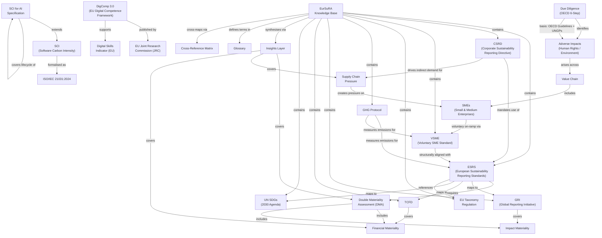

```mermaid
graph TD

%% Core EU Regulatory Layer
CSRD["CSRD\n(Corporate Sustainability\nReporting Directive)"]
ESRS["ESRS\n(European Sustainability\nReporting Standards)"]
VSME["VSME\n(Voluntary SME Standard)"]
EUT["EU Taxonomy\nRegulation"]
GHG["GHG Protocol"]

%% Frameworks
GRI["GRI\n(Global Reporting Initiative)"]
TCFD["TCFD"]
SDG["UN SDGs\n(2030 Agenda)"]

%% Key Concepts
DMA["Double Materiality\nAssessment (DMA)"]
FM["Financial Materiality"]
IM["Impact Materiality"]
SC["Supply Chain\nPressure"]
DD["Due Diligence\n(OECD 6-Step)"]
AI_ESG["Adverse Impacts\n(Human Rights / Environment)"]
VC["Value Chain"]

%% Green Software
SCI["SCI\n(Software Carbon Intensity)"]
SCI_AI["SCI for AI\nSpecification"]
ISO21031["ISO/IEC 21031:2024"]

%% Digital Skills
DigComp["DigComp 3.0\n(EU Digital Competence\nFramework)"]

%% SMEs
SME["SMEs\n(Small & Medium Enterprises)"]

%% Knowledge Base Structure
KB["EurSuRA\nKnowledge Base"]
Insights["Insights Layer"]
Glossary["Glossary"]
CRM["Cross-Reference Matrix"]

%% --- Relationships ---

%% Regulatory backbone
CSRD -->|"mandates use of"| ESRS
CSRD -->|"drives indirect demand for"| SC
SC -->|"creates pressure on"| SME
SME -->|"voluntary on-ramp via"| VSME
VSME -->|"structurally aligned with"| ESRS
ESRS -->|"requires"| DMA
DMA -->|"includes"| FM
DMA -->|"includes"| IM

%% Framework alignment
ESRS -->|"maps to"| GRI
ESRS -->|"maps to"| TCFD
ESRS -->|"maps to"| SDG
ESRS -->|"references"| EUT
GRI -->|"covers"| IM
TCFD -->|"covers"| FM
GHG -->|"measures emissions for"| ESRS
GHG -->|"measures emissions for"| VSME

%% Due diligence
DD -->|"identifies"| AI_ESG
AI_ESG -->|"arises across"| VC
VC -->|"includes"| SME
DD -->|"basis: OECD Guidelines +\nUNGPs"| AI_ESG

%% Green software
SCI -->|"formalised as"| ISO21031
SCI_AI -->|"extends"| SCI
SCI_AI -->|"covers lifecycle of"| SCI_AI

%% Knowledge base
KB -->|"contains"| ESRS
KB -->|"contains"| CSRD
KB -->|"contains"| VSME
KB -->|"contains"| EUT
KB -->|"contains"| GHG
KB -->|"contains"| GRI
KB -->|"contains"| TCFD
KB -->|"contains"| SDG
KB -->|"synthesises via"| Insights
KB -->|"defines terms in"| Glossary
KB -->|"cross-maps via"| CRM
Insights -->|"covers"| DMA
Insights -->|"covers"| SC
Insights -->|"covers"| FM

%% DigComp (tangential)
DigComp -->|"published by"| JRC["EU Joint Research\nCommission (JRC)"]
DigComp -->|"supports"| DSI["Digital Skills\nIndicator (EU)"]
```