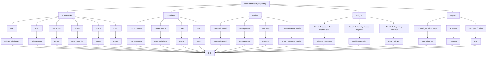

```mermaid
graph TD
    A[EU Sustainability Reporting] --> B[Frameworks]
    A --> C[Standards]
    A --> D[Models]
    A --> E[Insights]
    A --> F[Reports]

    B --> G[GRI]
    B --> H[TCFD]
    B --> I[UN SDGs]
    B --> J[VSME]
    B --> K[ESRS]
    B --> L[CSRD]

    C --> M[EU Taxonomy]
    C --> N[GHG Protocol]
    C --> O[CSRD]
    C --> P[ESRS]

    D --> Q[Semantic Model]
    D --> R[Concept Map]
    D --> S[Ontology]
    D --> T[Cross-Reference Matrix]

    E --> U[Climate Disclosure Across Frameworks]
    E --> V[Double Materiality Across Regimes]
    E --> W[The SME Reporting Pathway]

    F --> X[Due Diligence in 6 Steps]
    F --> Y[Adjacent]
    F --> Z[SCI Specification]

    G --> AA[Climate Disclosure]
    H --> AB[Climate Risk]
    I --> AC[SDGs]
    J --> AD[SME Reporting]
    K --> AE[ESRS]
    L --> AF[CSRD]

    M --> AG[EU Taxonomy]
    N --> AH[GHG Emissions]
    O --> AI[CSRD]
    P --> AJ[ESRS]

    Q --> AK[Semantic Model]
    R --> AL[Concept Map]
    S --> AM[Ontology]
    T --> AN[Cross-Reference Matrix]

    U --> AO[Climate Disclosure]
    V --> AP[Double Materiality]
    W --> AQ[SME Pathway]

    X --> AR[Due Diligence]
    Y --> AS[Adjacent]
    Z --> AT[SCI]

    AA --> AU[Climate Disclosure]
    AB --> AU[Climate Risk]
    AC --> AU[SDGs]
    AD --> AU[SME Reporting]
    AE --> AU[ESRS]
    AF --> AU[CSRD]

    AG --> AU[EU Taxonomy]
    AH --> AU[GHG Emissions]
    AI --> AU[CSRD]
    AJ --> AU[ESRS]

    AK --> AU[Semantic Model]
    AL --> AU[Concept Map]
    AM --> AU[Ontology]
    AN --> AU[Cross-Reference Matrix]

    AO --> AU[Climate Disclosure]
    AP --> AU[Double Materiality]
    AQ --> AU[SME Pathway]

    AR --> AU[Due Diligence]
    AS --> AU[Adjacent]
    AT --> AU[SCI]
```