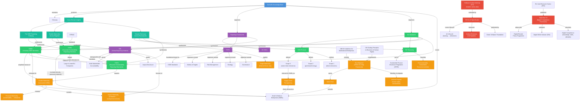

```mermaid
graph TD

    %% Core Knowledge Base
    KB["EurSuRA Knowledge Base"]:::kb
    KB -->|"covers"| SME["Small & Medium Enterprises (SMEs)"]
    KB -->|"organises"| Standards["EU Standards"]
    KB -->|"organises"| Frameworks["Reporting Frameworks"]
    KB -->|"produces"| Insights["Cross-Domain Insights"]
    KB -->|"maintains"| Glossary["Glossary"]

    %% Standards
    Standards --> CSRD["CSRD\n(Corporate Sustainability\nReporting Directive)"]
    Standards --> ESRS["ESRS\n(European Sustainability\nReporting Standards)"]
    Standards --> VSME["VSME\n(Voluntary SME Standard)"]
    Standards --> EUT["EU Taxonomy"]
    Standards --> GHG["GHG Protocol"]

    %% Frameworks
    Frameworks --> GRI["GRI\n(Global Reporting Initiative)"]
    Frameworks --> TCFD["TCFD"]
    Frameworks --> SDGs["UN SDGs"]

    %% CSRD → ESRS relationship
    CSRD -->|"mandates"| ESRS
    CSRD -->|"obliges"| LargeCompanies["Large & Listed EU Companies"]
    CSRD -->|"excludes directly, pressures indirectly"| SME

    %% VSME relationship
    EFRAG["EFRAG"] -->|"published"| VSME
    VSME -->|"proportionate alternative to"| ESRS
    VSME -->|"voluntary for"| SME
    VSME -->|"maps to"| ESRS

    %% Materiality
    ESRS -->|"requires"| DMA["Double Materiality\nAssessment (DMA)"]
    DMA -->|"includes"| FM["Financial Materiality\n(sustainability → enterprise)"]
    DMA -->|"includes"| IM["Impact Materiality\n(enterprise → society/environment)"]
    VSME -->|"simplified version of"| DMA
    TCFD -->|"applies"| SingleMat["Single Materiality\n(financial focus only)"]
    GRI -->|"focuses on"| IM

    %% GHG Protocol
    GHG -->|"defines"| Scope1["Scope 1\n(direct emissions)"]
    GHG -->|"defines"| Scope2["Scope 2\n(purchased energy)"]
    GHG -->|"defines"| Scope3["Scope 3\n(value-chain emissions)"]
    Scope3 -->|"relevant for SMEs via"| SupplyChain["Supply Chain\nTransparency"]
    SupplyChain -->|"drives demand on"| SME

    %% EU Taxonomy
    EUT -->|"classifies"| SustainableActivities["Environmentally Sustainable\nEconomic Activities"]
    EUT -->|"part of"| SFDR["Sustainable Finance\nDisclosure Regulation (SFDR)"]

    %% TCFD
    TCFD -->|"organises around"| Governance["Governance"]
    TCFD -->|"organises around"| Strategy["Strategy"]
    TCFD -->|"organises around"| RiskMgmt["Risk Management"]
    TCFD -->|"organises around"| MetricsTargets["Metrics & Targets"]
    TCFD -->|"foundational basis for"| ISSB["ISSB Standards"]

    %% GRI
    GRI -->|"guides"| ImpactDisclosure["Impact Disclosure"]
    GRI -->|"serves"| MultiStakeholder["Multi-Stakeholder\nAccountability"]
    GRI -->|"interoperable with"| ESRS

    %% Due Diligence
    DueDiligence["Due Diligence\n(OECD Six-Step Framework)"]
    OECDGuidelines["OECD Guidelines for\nMultinational Enterprises"] -->|"embeds"| DueDiligence
    UNGPs["UN Guiding Principles\non Business & Human Rights"] -->|"complements"| DueDiligence
    DueDiligence -->|"identifies & mitigates"| AdverseImpacts["Adverse Impacts\n(human rights, environment)"]
    DueDiligence -->|"spans"| ValueChain["Value Chain"]
    ValueChain -->|"includes"| SME

    %% SCI for AI
    SCI["Software Carbon Intensity (SCI)\nISO/IEC 21031:2024"] -->|"extended by"| SCIforAI["SCI for AI Specification"]
    SCIforAI -->|"published by"| GSF["Green Software Foundation"]
    SCIforAI -->|"measures"| CarbonEmissionsAI["Carbon Emissions\nof AI Systems"]
    SCIforAI -->|"covers lifecycle"| AILifecycle["AI Lifecycle\n(training → retirement)"]

    %% DigComp
    DigComp["DigComp 3.0\n(Digital Competence Framework)"]
    JRC["EU Joint Research Centre (JRC)"] -->|"published"| DigComp
    DigComp -->|"describes"| DigitalCompetence["Digital Competence\n(knowledge, skills, attitudes)"]
    DigComp -->|"underpins"| DSI["Digital Skills Indicator (DSI)"]
    DigComp -->|"aligns with"| DigitalDecade["Digital Decade\nPolicy Programme"]

    %% Insights linking back
    Insights --> ClimateInsight["Climate Disclosure\nAcross Frameworks"]
    Insights --> MatInsight["Double Materiality\nAcross Regimes"]
    Insights --> SMEInsight["The SME Reporting Pathway"]
    ClimateInsight -->|"synthesises"| ESRS
    ClimateInsight -->|"synthesises"| TCFD
    ClimateInsight -->|"synthesises"| GHG
    ClimateInsight -->|"synthesises"| EUT
    MatInsight -->|"synthesises"| CSRD
    MatInsight -->|"synthesises"| GRI
    SMEInsight -->|"synthesises"| VSME
    SMEInsight -->|"synthesises"| CSRD

    %% Styles
    classDef kb fill:#4a90d9,color:#fff,stroke:#2c6fad
    classDef standard fill:#2ecc71,color:#fff,stroke:#27ae60
    classDef framework fill:#9b59b6,color:#fff,stroke:#7d3c98
    classDef concept fill:#f39c12,color:#fff,stroke:#d68910
    classDef insight fill:#1abc9c,color:#fff,stroke:#17a589
    classDef report fill:#e74c3c,color:#fff,stroke:#c0392b

    class Standards,CSRD,ESRS,VSME,EUT,GHG standard
    class Frameworks,GRI,TCFD,SDGs framework
    class DMA,FM,IM,SingleMat,DueDiligence,AdverseImpacts,ValueChain,SupplyChain,SustainableActivities concept
    class Insights,ClimateInsight,MatInsight,SMEInsight insight
    class SCI,SCIforAI,DigComp,CarbonEmissionsAI report
```