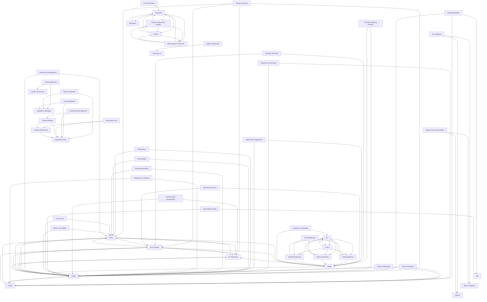

```mermaid
flowchart TB
    %% ========== LAYER 1: TOP-LEVEL DRIVERS ==========
    ClimateDisclosure[Climate Disclosure]
    DoubleMateriality[Double Materiality]
    SMERouting[The SME Reporting Pathway]
    DueDiligence[Due Diligence]
    DigitalComp[Digital Competence]
    VoluntaryRep[Voluntary Reporting]
    CorpSustain[Corporate Sustainability]
    ClimateRiskMgmt[Climate Risk Management]
    ClimateResilience[Climate Resilience]
    ClimateAdaptation[Climate Adaptation]
    ClimateMitigation[Climate Mitigation]
    ClimateMigration[Climate-Induced Migration]
    IntlLaw[International Law]
    SupplyChainResp[Supply Chain Responsibility]
    StakeholderEng[Stakeholder Engagement]
    Transparency[Transparency]
    Accountability[Accountability]
    ReportingStd[Reporting Standards]
    RegCompliance[Regulatory Compliance]
    VoluntaryDisc[Voluntary Disclosure]
    EnvSustain[Environmental Sustainability]
    SocialResp[Social Responsibility]
    Governance[Governance]
    MetricsTargets[Metrics and Targets]

    %% ========== LAYER 2: CORE FRAMEWORKS ==========
    ESRS[ESRS]
    CSRD[CSRD]
    TCFD[TCFD]
    GHGProtocol[GHG Protocol]
    EU_Taxonomy[EU Taxonomy]
    VSME[VSME]
    GRI[GRI]
    OECDGuidelines[OECD Guidelines]
    UNGPs[UNGPs]

    %% ========== LAYER 3: MATERIALITY BREAKDOWN ==========
    ImpactMateriality[Impact Materiality]
    FinancialMateriality[Financial Materiality]

    %% ========== LAYER 4: SCI / SOFTWARE SUSTAINABILITY ==========
    SCI[SCI]
    Action[Action]
    EnergyEfficiency[Energy Efficiency]
    HardwareEfficiency[Hardware Efficiency]
    CarbonAwareness[Carbon Awareness]
    SCISpec[SCI Specification]

    %% ========== LAYER 5: CLIMATE FINANCE & ADAPTATION ==========
    AdaptationFunds[Adaptation Funds]
    AdaptationStrategies[Adaptation Strategies]
    ClimateGovernance[Climate Governance]
    ClimateRefugee[Climate Refugee]
    FundingMechanisms[Funding Mechanisms]

    %% ========== LAYER 6: ADSORPTION / MATERIALS ==========
    Adsorbent[Adsorbent]
    Adsorption[Adsorption]
    CarbonCapture[Carbon Capture and Storage]
    Zeolite[Zeolite]
    MOF[Metal-Organic Framework]
    PostCombustion[Post-Combustion]

    %% ========== LAYER 7: DIGCOMP ==========
    DigComp[DigComp 3.0]

    %% ========== INVISIBLE EDGES FOR VERTICAL ORDERING =====
    %% Force top-down layering
    ClimateDisclosure ~~~ DoubleMateriality
    DoubleMateriality ~~~ SMERouting
    SMERouting ~~~ DueDiligence
    DueDiligence ~~~ DigitalComp
    DigitalComp ~~~ VoluntaryRep
    VoluntaryRep ~~~ CorpSustain
    CorpSustain ~~~ ClimateRiskMgmt
    ClimateRiskMgmt ~~~ ClimateResilience
    ClimateResilience ~~~ ClimateAdaptation
    ClimateAdaptation ~~~ ClimateMitigation
    ClimateMitigation ~~~ ClimateMigration
    ClimateMigration ~~~ IntlLaw
    IntlLaw ~~~ SupplyChainResp
    SupplyChainResp ~~~ StakeholderEng
    StakeholderEng ~~~ Transparency
    Transparency ~~~ Accountability
    Accountability ~~~ ReportingStd
    ReportingStd ~~~ RegCompliance
    RegCompliance ~~~ VoluntaryDisc
    VoluntaryDisc ~~~ EnvSustain
    EnvSustain ~~~ SocialResp
    SocialResp ~~~ Governance
    Governance ~~~ MetricsTargets

    %% Core frameworks ordering
    ESRS ~~~ CSRD
    CSRD ~~~ TCFD
    TCFD ~~~ GHGProtocol
    GHGProtocol ~~~ EU_Taxonomy
    EU_Taxonomy ~~~ VSME
    VSME ~~~ GRI
    GRI ~~~ OECDGuidelines
    OECDGuidelines ~~~ UNGPs

    %% ========== VISIBLE RELATIONSHIPS ==========
    %% Climate Disclosure -> Core Frameworks
    ClimateDisclosure --> ESRS
    ClimateDisclosure --> TCFD
    ClimateDisclosure --> GHGProtocol
    ClimateDisclosure --> EU_Taxonomy

    %% Double Materiality -> Core Frameworks
    DoubleMateriality --> CSRD
    DoubleMateriality --> ESRS
    DoubleMateriality --> GRI

    %% SME Reporting Pathway
    SMERouting --> VSME
    SMERouting --> ESRS

    %% Due Diligence
    DueDiligence --> OECDGuidelines
    DueDiligence --> UNGPs

    %% Digital Competence
    DigitalComp --> DigComp

    %% Voluntary Reporting
    VoluntaryRep --> VSME
    VoluntaryRep --> GHGProtocol

    %% Corporate Sustainability
    CorpSustain --> CSRD
    CorpSustain --> ESRS

    %% Materiality Breakdown
    ImpactMateriality --> ESRS
    ImpactMateriality --> CSRD
    FinancialMateriality --> ESRS
    FinancialMateriality --> CSRD

    %% Supply Chain & Stakeholder
    SupplyChainResp --> OECDGuidelines
    SupplyChainResp --> UNGPs
    StakeholderEng --> VSME
    StakeholderEng --> ESRS

    %% Transparency & Accountability
    Transparency --> ESRS
    Transparency --> TCFD
    Accountability --> ESRS
    Accountability --> TCFD

    %% Reporting Standards & Compliance
    ReportingStd --> ESRS
    ReportingStd --> TCFD
    RegCompliance --> CSRD
    RegCompliance --> ESRS
    VoluntaryDisc --> VSME
    VoluntaryDisc --> GHGProtocol

    %% Environmental & Social
    EnvSustain --> EU_Taxonomy
    EnvSustain --> ESRS
    SocialResp --> ESRS
    SocialResp --> GRI

    %% Governance & Metrics
    Governance --> TCFD
    Governance --> ESRS
    MetricsTargets --> TCFD
    MetricsTargets --> ESRS

    %% Climate Risk & Resilience
    ClimateRiskMgmt --> TCFD
    ClimateRiskMgmt --> ESRS
    ClimateResilience --> AdaptationStrategies
    ClimateResilience --> ClimateGovernance

    %% Climate Adaptation & Mitigation
    ClimateAdaptation --> AdaptationFunds
    ClimateAdaptation --> AdaptationStrategies
    ClimateMitigation --> AdaptationFunds
    ClimateMitigation --> AdaptationStrategies

    %% Climate Migration & International Law
    ClimateMigration --> AdaptationFunds
    ClimateMigration --> ClimateRefugee
    IntlLaw --> AdaptationFunds
    IntlLaw --> FundingMechanisms
    ClimateRefugee --> AdaptationFunds
    ClimateRefugee --> FundingMechanisms
    FundingMechanisms --> AdaptationFunds

    %% SCI Cluster
    EnergyEfficiency --> SCI
    EnergyEfficiency --> VSME
    CarbonAwareness --> SCI
    CarbonAwareness --> VSME
    HardwareEfficiency --> SCI
    HardwareEfficiency --> VSME
    SoftwareSustain[Software Sustainability] --> SCI
    SoftwareSustain --> VSME

    SCI --> Action
    SCI --> EnergyEfficiency
    SCI --> HardwareEfficiency
    SCI --> CarbonAwareness

    Action --> SCI
    Action --> EnergyEfficiency
    Action --> HardwareEfficiency
    Action --> CarbonAwareness

    SCISpec --> Action
    SCISpec --> EnergyEfficiency
    SCISpec --> HardwareEfficiency
    SCISpec --> CarbonAwareness

    %% Adsorption / Materials Science
    Adsorbent --> Adsorption
    Adsorbent --> CarbonCapture
    Adsorbent --> Zeolite
    Adsorbent --> MOF

    PostCombustion --> Adsorbent
    Adsorption --> Adsorbent
    CarbonCapture --> Adsorbent
    CarbonCapture --> Zeolite
    CarbonCapture --> MOF
    Zeolite --> Adsorbent
    Zeolite --> CarbonCapture
    Zeolite --> MOF
    MOF --> Adsorbent
    MOF --> CarbonCapture
    MOF --> Zeolite
    PostCombustion -.-> Adsorption

    %% VSME Standards
    VSME --> ESRS
    VSME --> TCFD
    VSME --> GHGProtocol
    VSME --> EU_Taxonomy

    %% Core Standards Interconnections (bidirectional awareness)
    ESRS --> CSRD
    ESRS --> TCFD
    ESRS --> GHGProtocol
    ESRS --> EU_Taxonomy

    CSRD --> ESRS
    CSRD --> TCFD
    CSRD --> GHGProtocol

    TCFD --> ESRS
    TCFD --> GHGProtocol
    TCFD --> EU_Taxonomy

    GHGProtocol --> ESRS
    GHGProtocol --> TCFD
    GHGProtocol --> EU_Taxonomy

    EU_Taxonomy --> ESRS
    EU_Taxonomy --> TCFD
    EU_Taxonomy --> GHGProtocol
```