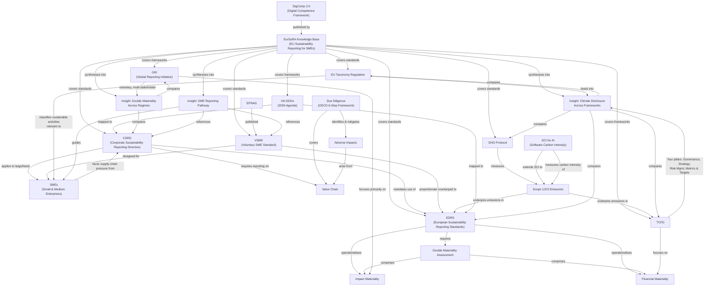

```mermaid
graph TD

    %% Core Knowledge Base
    KB["EurSuRA Knowledge Base\n(EU Sustainability Reporting for SMEs)"]

    %% Standards
    CSRD["CSRD\n(Corporate Sustainability Reporting Directive)"]
    ESRS["ESRS\n(European Sustainability Reporting Standards)"]
    VSME["VSME\n(Voluntary SME Standard)"]
    EUTAX["EU Taxonomy Regulation"]
    GHG["GHG Protocol"]

    %% Frameworks
    GRI["GRI\n(Global Reporting Initiative)"]
    TCFD["TCFD"]
    SDGs["UN SDGs\n(2030 Agenda)"]

    %% Key Concepts
    DMA["Double Materiality Assessment"]
    FM["Financial Materiality"]
    IM["Impact Materiality"]
    DD["Due Diligence\n(OECD 6-Step Framework)"]
    AI_SCI["SCI for AI\n(Software Carbon Intensity)"]
    DigComp["DigComp 3.0\n(Digital Competence Framework)"]
    SME["SMEs\n(Small & Medium Enterprises)"]
    VC["Value Chain"]
    AI["Adverse Impacts"]
    SC1["Scope 1/2/3 Emissions"]
    EFRAG["EFRAG"]

    %% Insights / Synthesis
    CDI["Insight: Climate Disclosure\nAcross Frameworks"]
    DMI["Insight: Double Materiality\nAcross Regimes"]
    SMEP["Insight: SME Reporting Pathway"]

    %% Knowledge Base contains everything
    KB -->|"covers standards"| CSRD
    KB -->|"covers standards"| ESRS
    KB -->|"covers standards"| VSME
    KB -->|"covers standards"| EUTAX
    KB -->|"covers standards"| GHG
    KB -->|"covers frameworks"| GRI
    KB -->|"covers frameworks"| TCFD
    KB -->|"covers frameworks"| SDGs
    KB -->|"synthesises into"| CDI
    KB -->|"synthesises into"| DMI
    KB -->|"synthesises into"| SMEP

    %% CSRD → ESRS
    CSRD -->|"mandates use of"| ESRS
    CSRD -->|"applies to large/listed"| SME
    CSRD -->|"requires reporting on"| VC

    %% ESRS → concepts
    ESRS -->|"requires"| DMA
    ESRS -->|"operationalises"| FM
    ESRS -->|"operationalises"| IM
    DMA -->|"comprises"| FM
    DMA -->|"comprises"| IM

    %% VSME
    EFRAG -->|"published"| VSME
    VSME -->|"proportionate counterpart to"| ESRS
    VSME -->|"designed for"| SME
    SME -->|"faces supply-chain pressure from"| CSRD

    %% GHG Protocol
    GHG -->|"measures"| SC1
    SC1 -->|"underpins emissions in"| ESRS
    SC1 -->|"underpins emissions in"| TCFD

    %% TCFD
    TCFD -->|"focuses on"| FM
    TCFD -->|"four pillars: Governance, Strategy,\nRisk Mgmt, Metrics & Targets"| CDI

    %% GRI
    GRI -->|"focuses primarily on"| IM
    GRI -->|"voluntary, multi-stakeholder"| DMI

    %% EU Taxonomy
    EUTAX -->|"classifies sustainable activities\nrelevant to"| SME
    EUTAX -->|"feeds into"| CDI

    %% Due Diligence
    DD -->|"identifies & mitigates"| AI
    DD -->|"covers"| VC
    AI -->|"arise from"| VC

    %% SCI for AI
    AI_SCI -->|"extends SCI to"| SC1
    AI_SCI -->|"measures carbon intensity of"| SC1

    %% DigComp
    DigComp -->|"published by"| KB

    %% SDGs
    SDGs -->|"mapped to"| CSRD
    SDGs -->|"mapped to"| ESRS

    %% Insight connections
    CDI -->|"compares"| ESRS
    CDI -->|"compares"| TCFD
    CDI -->|"compares"| GHG
    CDI -->|"compares"| EUTAX
    DMI -->|"compares"| CSRD
    DMI -->|"compares"| GRI
    SMEP -->|"guides"| SME
    SMEP -->|"references"| VSME
    SMEP -->|"references"| CSRD
```