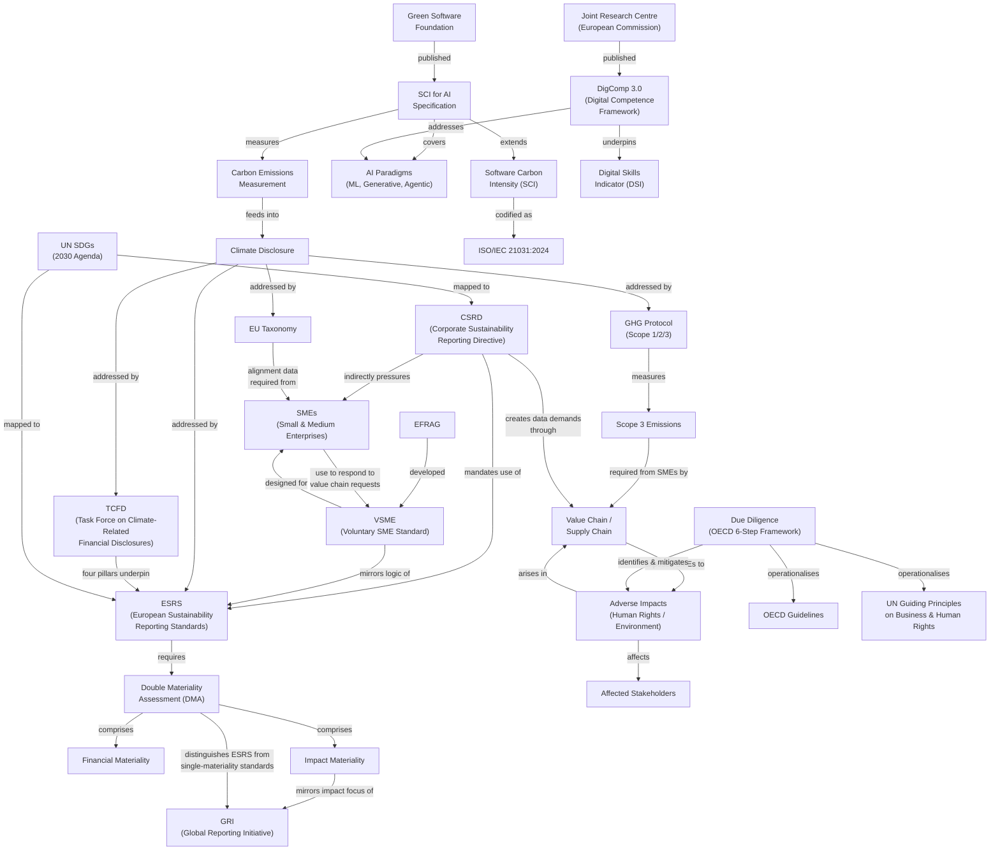

```mermaid
graph TD

    %% Core Sustainability Reporting Frameworks
    CSRD["CSRD\n(Corporate Sustainability\nReporting Directive)"]
    ESRS["ESRS\n(European Sustainability\nReporting Standards)"]
    VSME["VSME\n(Voluntary SME Standard)"]
    GRI["GRI\n(Global Reporting Initiative)"]
    TCFD["TCFD\n(Task Force on Climate-Related\nFinancial Disclosures)"]
    GHG["GHG Protocol\n(Scope 1/2/3)"]
    EUTax["EU Taxonomy"]
    SDGs["UN SDGs\n(2030 Agenda)"]

    %% Key Concepts
    DMA["Double Materiality\nAssessment (DMA)"]
    FinMat["Financial Materiality"]
    ImpMat["Impact Materiality"]
    ClimDisc["Climate Disclosure"]
    Scope3["Scope 3 Emissions"]
    SME["SMEs\n(Small & Medium Enterprises)"]
    SupplyChain["Value Chain /\nSupply Chain"]
    DueDiligence["Due Diligence\n(OECD 6-Step Framework)"]
    AdverseImpact["Adverse Impacts\n(Human Rights / Environment)"]
    Stakeholders["Affected Stakeholders"]
    EFRAG["EFRAG"]
    OECD["OECD Guidelines"]
    UNGPs["UN Guiding Principles\non Business & Human Rights"]

    %% SCI / AI / Digital
    SCI["Software Carbon\nIntensity (SCI)"]
    SCI_AI["SCI for AI\nSpecification"]
    ISO21031["ISO/IEC 21031:2024"]
    GreenSoftware["Green Software\nFoundation"]
    AIParadigms["AI Paradigms\n(ML, Generative, Agentic)"]
    CarbonEmissions["Carbon Emissions\nMeasurement"]
    DigComp["DigComp 3.0\n(Digital Competence\nFramework)"]
    JRC["Joint Research Centre\n(European Commission)"]
    DigitalSkills["Digital Skills\nIndicator (DSI)"]

    %% CSRD/ESRS relationships
    CSRD -->|"mandates use of"| ESRS
    CSRD -->|"indirectly pressures"| SME
    ESRS -->|"requires"| DMA
    DMA -->|"comprises"| FinMat
    DMA -->|"comprises"| ImpMat
    EFRAG -->|"developed"| VSME
    VSME -->|"mirrors logic of"| ESRS
    VSME -->|"designed for"| SME
    SME -->|"use to respond to\nvalue chain requests"| VSME

    %% Climate Disclosure
    ClimDisc -->|"addressed by"| TCFD
    ClimDisc -->|"addressed by"| ESRS
    ClimDisc -->|"addressed by"| GHG
    ClimDisc -->|"addressed by"| EUTax
    TCFD -->|"four pillars underpin"| ESRS
    GHG -->|"measures"| Scope3
    Scope3 -->|"required from SMEs by"| SupplyChain
    EUTax -->|"alignment data\nrequired from"| SME

    %% Double Materiality
    ImpMat -->|"mirrors impact focus of"| GRI
    DMA -->|"distinguishes ESRS from\nsingle-materiality standards"| GRI

    %% SDGs
    SDGs -->|"mapped to"| ESRS
    SDGs -->|"mapped to"| CSRD

    %% Supply Chain / Value Chain
    CSRD -->|"creates data demands\nthrough"| SupplyChain
    SupplyChain -->|"exposes SMEs to"| AdverseImpact

    %% Due Diligence
    DueDiligence -->|"operationalises"| OECD
    DueDiligence -->|"operationalises"| UNGPs
    DueDiligence -->|"identifies & mitigates"| AdverseImpact
    AdverseImpact -->|"affects"| Stakeholders
    AdverseImpact -->|"arises in"| SupplyChain

    %% SCI / AI
    GreenSoftware -->|"published"| SCI_AI
    SCI_AI -->|"extends"| SCI
    SCI -->|"codified as"| ISO21031
    SCI_AI -->|"covers"| AIParadigms
    SCI_AI -->|"measures"| CarbonEmissions
    CarbonEmissions -->|"feeds into"| ClimDisc

    %% DigComp
    JRC -->|"published"| DigComp
    DigComp -->|"underpins"| DigitalSkills
    DigComp -->|"addresses"| AIParadigms
```