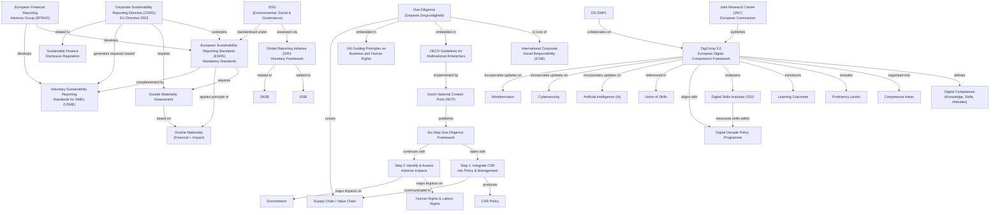

```mermaid
graph TD

    %% ESG & Sustainability Reporting
    ESG["ESG\n(Environmental, Social & Governance)"]
    GRI["Global Reporting Initiative (GRI)\nVoluntary Framework"]
    ESRS["European Sustainability Reporting Standards (ESRS)\nMandatory Standards"]
    CSRD["Corporate Sustainability Reporting Directive (CSRD)\nEU Directive 2023"]
    DMA["Double Materiality Assessment"]
    DoubleMat["Double Materiality\n(Financial + Impact)"]
    VSME["Voluntary Sustainability Reporting\nStandards for SMEs (VSME)"]
    EFRAG["European Financial Reporting\nAdvisory Group (EFRAG)"]
    ISSB["ISSB"]
    SASB["SASB"]
    SFDR["Sustainable Finance\nDisclosure Regulation"]

    ESG -->|"assessed via"| GRI
    ESG -->|"standardised under"| ESRS
    CSRD -->|"underpins"| ESRS
    CSRD -->|"requires"| DMA
    ESRS -->|"requires"| DMA
    ESRS -->|"applies principle of"| DoubleMat
    DMA -->|"based on"| DoubleMat
    CSRD -->|"generates requests toward"| VSME
    ESRS -->|"complemented by"| VSME
    EFRAG -->|"develops"| ESRS
    EFRAG -->|"develops"| VSME
    GRI -->|"related to"| ISSB
    GRI -->|"related to"| SASB
    CSRD -->|"related to"| SFDR

    %% Due Diligence
    DD["Due Diligence\n(Gepaste Zorgvuldigheid)"]
    ICSR["International Corporate\nSocial Responsibility (ICSR)"]
    OECD["OECD Guidelines for\nMultinational Enterprises"]
    UNGPs["UN Guiding Principles on\nBusiness and Human Rights"]
    NCP["Dutch National Contact Point (NCP)"]
    SixStep["Six-Step Due Diligence Framework"]
    S1["Step 1: Integrate CSR\ninto Policy & Management"]
    S2["Step 2: Identify & Assess\nAdverse Impacts"]
    CSRPolicy["CSR Policy"]
    SupplyChain["Supply Chain / Value Chain"]
    HumanRights["Human Rights & Labour Rights"]
    Environment["Environment"]

    DD -->|"is core of"| ICSR
    DD -->|"embedded in"| OECD
    DD -->|"embedded in"| UNGPs
    OECD -->|"implemented by"| NCP
    NCP -->|"publishes"| SixStep
    SixStep -->|"starts with"| S1
    SixStep -->|"continues with"| S2
    S1 -->|"produces"| CSRPolicy
    S1 -->|"communicated to"| SupplyChain
    S2 -->|"maps impacts on"| HumanRights
    S2 -->|"maps impacts on"| Environment
    DD -->|"covers"| SupplyChain

    %% DigComp
    DigComp["DigComp 3.0\nEuropean Digital Competence Framework"]
    JRC["Joint Research Centre (JRC)\nEuropean Commission"]
    DGEMPL["DG EMPL"]
    DigComp30Def["Digital Competence\n(Knowledge, Skills, Attitudes)"]
    CompAreas["Competence Areas"]
    ProfLevels["Proficiency Levels"]
    LearningOut["Learning Outcomes"]
    DSI["Digital Skills Indicator (DSI)"]
    DigDecade["Digital Decade Policy Programme"]
    UnionSkills["Union of Skills"]
    AI["Artificial Intelligence (AI)"]
    Cybersecurity["Cybersecurity"]
    Misinformation["Misinformation"]

    JRC -->|"publishes"| DigComp
    DGEMPL -->|"collaborates on"| DigComp
    DigComp -->|"defines"| DigComp30Def
    DigComp -->|"organised into"| CompAreas
    DigComp -->|"includes"| ProfLevels
    DigComp -->|"introduces"| LearningOut
    DigComp -->|"underpins"| DSI
    DSI -->|"measures skills within"| DigDecade
    DigComp -->|"aligns with"| DigDecade
    DigComp -->|"referenced in"| UnionSkills
    DigComp -->|"incorporates updates on"| AI
    DigComp -->|"incorporates updates on"| Cybersecurity
    DigComp -->|"incorporates updates on"| Misinformation
```